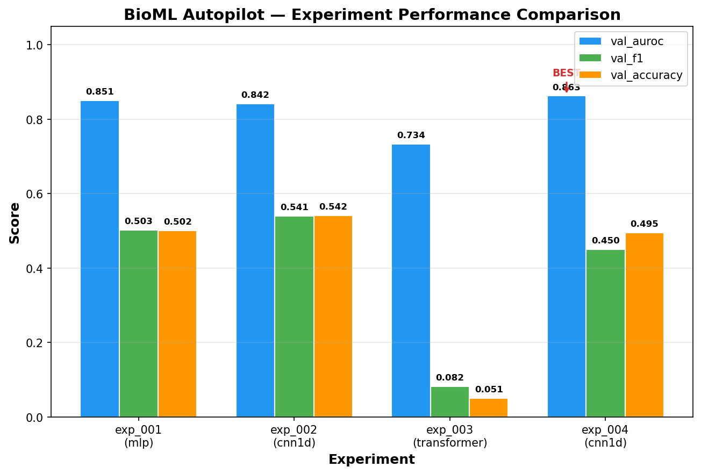

# BioML Autopilot — Autonomous Bio-ML Research Platform

An autonomous machine learning research platform that uses an LLM (via HuggingFace) as a scientific advisor to iteratively design, run, and evaluate experiments on biological classification data — without human intervention.

## Overview

BioML Autopilot tackles the protein localization classification problem on the [Yeast dataset](https://archive.ics.uci.edu/ml/datasets/Yeast) (8 numerical features, 10 classes). The system operates in an autonomous loop where an LLM proposes experiment configurations, the platform trains and evaluates models, and the LLM analyzes results to decide the next step.

### Key Features

- **LLM-in-the-loop**: HuggingFace-hosted LLM acts as a scientific advisor, proposing experiments, analyzing results, and deciding when to stop
- **Multiple architectures**: MLP (with residual connections), 1D CNN, TabTransformer, and Ensemble (soft voting)
- **Autonomous research loop**: No human intervention needed — the system explores the search space, tracks experiments, detects duplicates, and generates a final report
- **Graceful fallback**: Runs random search if no HuggingFace API key is provided
- **Configurable**: YAML-based configuration with CLI overrides and environment variable support

## Experiment Performance

The visualization below shows the performance comparison (val_auroc, val_f1, val_accuracy) across different experiments and architectures explored by the autonomous pipeline:



**Best result**: CNN1D architecture achieved the highest val_auroc of **0.863** (exp_004).

## Project Structure

```
├── config/
│   ├── base.yaml              # Base configuration
│   └── search_space.yaml      # LLM-explorable hyperparameter space
├── src/
│   ├── cli.py                 # Click CLI interface
│   ├── config.py              # Config loading & merging
│   ├── orchestrator.py        # Core autonomous loop
│   ├── data/
│   │   ├── loader.py          # Data loading, splitting, scaling
│   │   └── augmentation.py    # Mixup augmentation
│   ├── llm/
│   │   ├── agent.py           # HuggingFace LLM integration
│   │   ├── prompts.py         # Prompt templates
│   │   └── parser.py          # JSON parsing & validation
│   ├── models/
│   │   ├── factory.py         # Model registry & factory
│   │   ├── mlp.py             # MLP with residual connections
│   │   ├── cnn1d.py           # 1D CNN for tabular data
│   │   ├── transformer.py     # TabTransformer
│   │   └── ensemble.py        # Ensemble (soft voting)
│   ├── training/
│   │   ├── trainer.py         # Training loop
│   │   ├── evaluator.py       # Metrics (AUC-ROC, F1, Accuracy)
│   │   └── callbacks.py       # Early stopping & checkpointing
│   └── experiment/
│       ├── tracker.py         # Experiment lifecycle tracking
│       └── registry.py        # Duplicate detection
├── experiments/               # Experiment results output
├── train.py                   # Main entry point
├── run_autonomous.py          # Shortcut for autonomous mode
├── visualize.py               # Generate performance visualization
├── prepare.py                 # Data preparation
├── yeast.csv                  # Dataset
└── .env                       # HuggingFace API key (not tracked in git)
```

## Setup

### 1. Install dependencies

```bash
pip install -r requirements.txt
```

### 2. Configure your HuggingFace API key

Create a `.env` file in the project root (it is already gitignored):

```bash
cp .env.example .env
```

Then edit `.env` and add your HuggingFace token:

```
HF_TOKEN=hf_your_actual_token_here
```

Get your token at: https://huggingface.co/settings/tokens

The `.env` file is automatically loaded at runtime — no code changes needed.

### 3. Optional environment variables

You can also set these in your `.env` file:

| Variable | Description | Default |
|---|---|---|
| `HF_TOKEN` | HuggingFace API token (required for LLM mode) | — |
| `BIOML_LLM_MODEL` | Override LLM model ID | `mistralai/Mistral-7B-Instruct-v0.3` |
| `BIOML_MAX_EXPERIMENTS` | Max experiments per run | `20` |
| `BIOML_TIME_BUDGET` | Time budget per experiment (seconds) | `300` |

## Usage

### Single experiment

```bash
# Default configuration
python train.py

# With overrides
python train.py --arch transformer --lr 0.0005 --epochs 150
```

### Autonomous LLM-in-the-loop research

```bash
# Full autonomous run
python train.py --auto

# With experiment budget
python train.py --auto --max-experiments 10

# Shortcut
python run_autonomous.py -n 5
```

### View results

```bash
# Leaderboard
python train.py --leaderboard

# Generate performance visualization
python visualize.py
```

### CLI interface

```bash
bioml-autopilot train --arch mlp
bioml-autopilot auto --max-experiments 20
bioml-autopilot leaderboard --top 10
```

## How It Works

1. **LLM Proposal** — The LLM receives experiment history, the search space, and dataset info, then proposes the next experiment configuration with reasoning
2. **Training** — The system trains the proposed model with early stopping, gradient clipping, and optional mixup augmentation
3. **Evaluation** — Models are evaluated on val_auroc (macro one-vs-rest AUC-ROC), val_f1, and val_accuracy
4. **Analysis** — Every 3 experiments, the LLM analyzes all results and decides whether to continue or stop
5. **Report** — A final markdown report is generated with findings and recommendations

### Stopping Criteria

- No improvement for N experiments (plateau detection)
- LLM recommends stopping (diminishing returns)
- Maximum experiment budget reached

## Configuration

All settings are in `config/base.yaml`. The search space the LLM explores is defined in `config/search_space.yaml`. Both can be overridden via CLI flags or environment variables.
